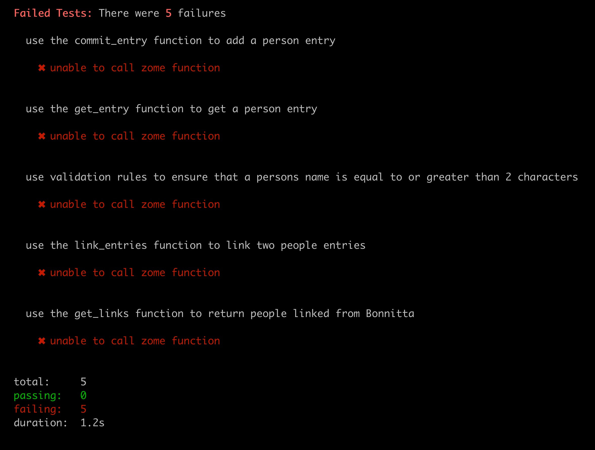

# Learn to Build with Holochain Rust

This repository is a tool for learning about writing apps with Holochain.

It uses a pattern called "test driven development" for teaching. This is where there are predefined "tests", which define how the application should behave, and which functions should exist. When you run the tests, you will see descriptions of that functionality, alongside the expected result. 

As a developer in training, it is your job to work to implement the functionality to get the tests passing.

There is boilerplate code already in place so that you can focus on the interesting parts.

Once you make a change in the code, you will rerun the command that runs the tests.

The test file is located in `test/index.js`.

## Instructions

Make sure Holochain is [installed](https://developer.holochain.org/start.html)

Download this repository to your computer.

Open a terminal. 

Change directories in your terminal this apps folder on your computer, wherever it was downloaded to. (Use or lookup `cd` command if you're not familiar)

If you are on Windows, open Git Bash, and run

```shell
sh ./test.sh
```

If you are on Mac or Linux, just run

```shell
./test.sh
```

You will see that all the tests are failing.




